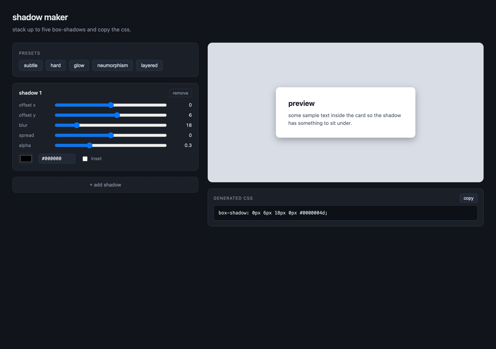

# shadow-maker



a small tool for stacking css `box-shadow` layers and copying the result. plain html, css, js. open `index.html`, no build.

i kept tweaking shadows by hand in devtools and getting the order wrong, so i made this. five layers max because past that nobody is reading the css anyway.

## what it does

- up to 5 shadow layers, each with offset x, offset y, blur, spread, color, alpha, and inset
- live preview on a sample card so you can see what you're building
- generated `box-shadow` value shown below the preview, one click to copy
- five presets to start from: subtle, hard, glow, neumorphism, layered

## how the css is built

each layer is just a string:

```
[inset] x y blur spread color
```

and the final value is those joined with `, ` in the order they appear in the panel. order matters: the first layer renders on top of the next one, which is why the layered preset goes from tight-and-dark to wide-and-faint as you go down.

colors carry alpha as an 8-digit hex (`#rrggbbaa`). the native color input doesn't do alpha, so there's a separate alpha slider per layer, and on render the slider value gets baked into the hex. presets ship with explicit 8-digit colors and the slider is ignored for those (alpha set to 1, hex carries it).

## running

```
git clone https://github.com/secanakbulut/shadow-maker.git
cd shadow-maker
open index.html
```

works as a `file://` page, no server needed. clipboard copy uses `navigator.clipboard` so some browsers want a secure context, in which case `python3 -m http.server` and visit `localhost:8000`.

## files

- `index.html` — markup and the layout shell
- `style.css` — dark control panel, light stage so shadows actually read
- `app.js` — layer state, the shadow string composer, presets, copy

## license

PolyForm Noncommercial 1.0.0. fine for personal and hobby use, not for resale or commercial use. see `LICENSE`.
